# Command Line Coffee

[View the live project here](https://command-line-coffee-c81dfcb828b5.herokuapp.com/)

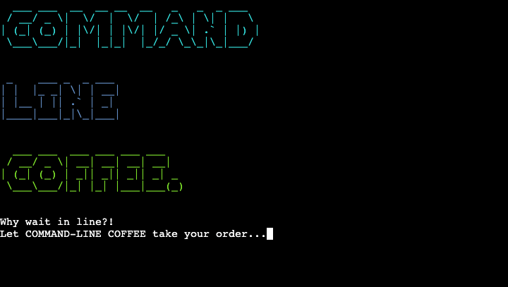

**Command Line Coffee** command-line interface (CLI) application, made with Python. It’s a back-end project, hosted by a front-end [mock terminal](https://github.com/Code-Institute-Org/python-essentials-template) made by [Code Institute](https://codeinstitute.net/), and deployed using [Heroku](https://www.heroku.com/). It uses Google Sheets for a database, via the **gspread API**.

It is built to be used by a coffee stall in the foyer of a large co-working space. Customers can make an order from their desks, and then walk down and pick it up when it’s ready. The retro look of a command-line interface gives the user the feeling of using a quirky computer program from the 1970s.

## Features

### Title & Introduction

Displays the program title, using **pyfiglet** for the ASCII art font and **termcolor** for the text colours.

The `time.sleep()` function is used to stagger the printing of the title, and the introduction text is styled with a typing effect.

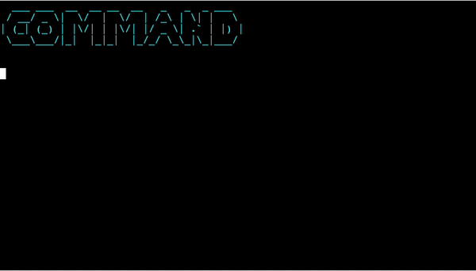

### Enter

The user is asked if they want to see the menu.

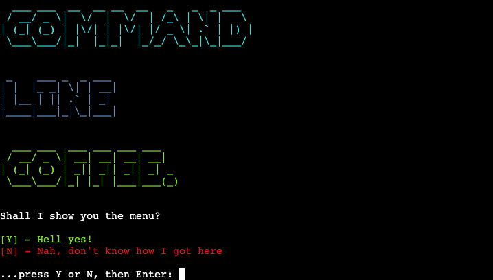

### Display Coffee Menu

The coffee menu is pulled from Google Sheets and displayed as a table using **tabulate.**

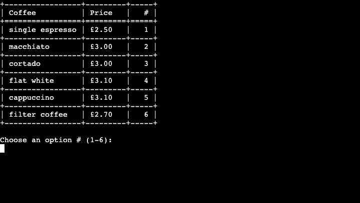

The Google Sheet is easily edited by the barista, enabling them to change prices and coffee types without having to edit the Python code. 

The ‘coffee-menu’ spreadsheet looks like this inside Google Sheets:

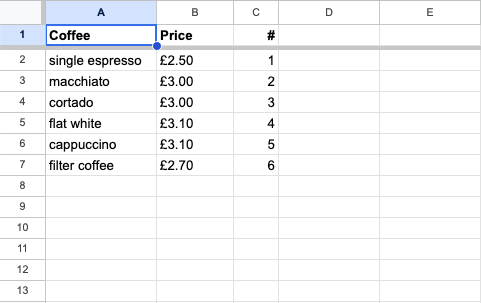

### Choose Coffee and Quantity

The user is asked to choose the coffee type and the quantity. 

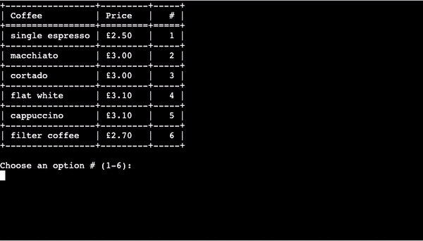

### Add More Coffee

The option is given to add to the order.

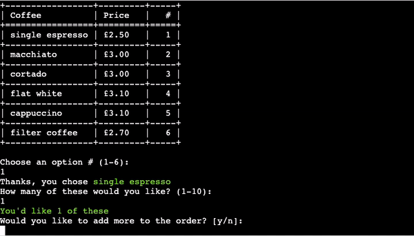

### Customer Name

The user is asked for their name, to be used as an order reference.

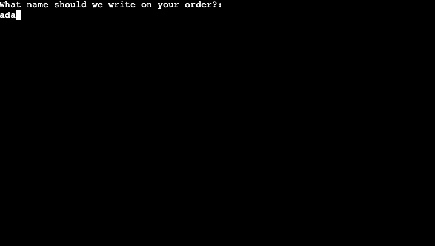

Upon entering a name, the order is sent to the Google Sheet ‘orders’, and appears like this to the barista:

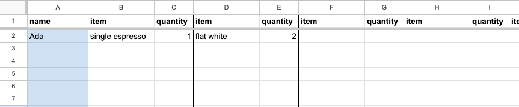

### Display Pending Order

The order is then imported back into the program from the ‘orders’ Google Sheet, and displayed to the user as a table, using **tabulate**.

Underneath the table, Python functions calculate the total cost, waiting time, and display the time of order.

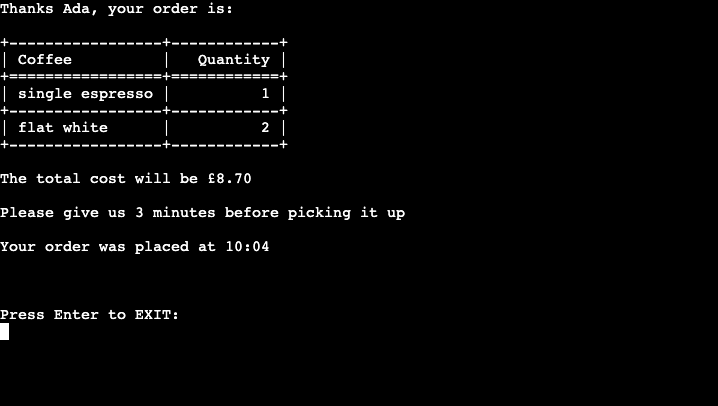

### Goodbye

The user is given the option to exit the program, and a ‘thank you’ message is displayed.

## Flowcharts

### Title:

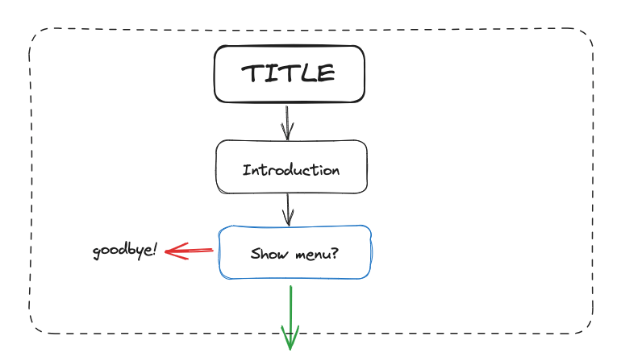

### Menu:

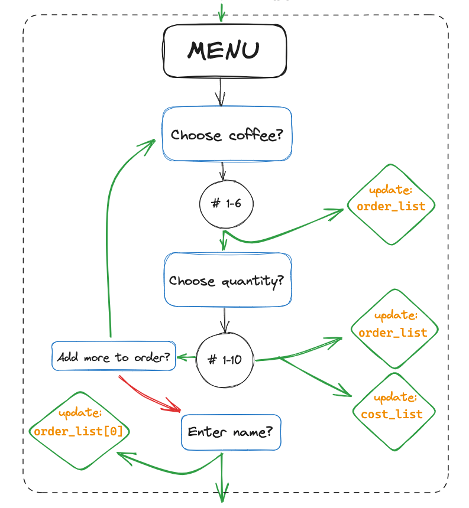

### Update database & display order:

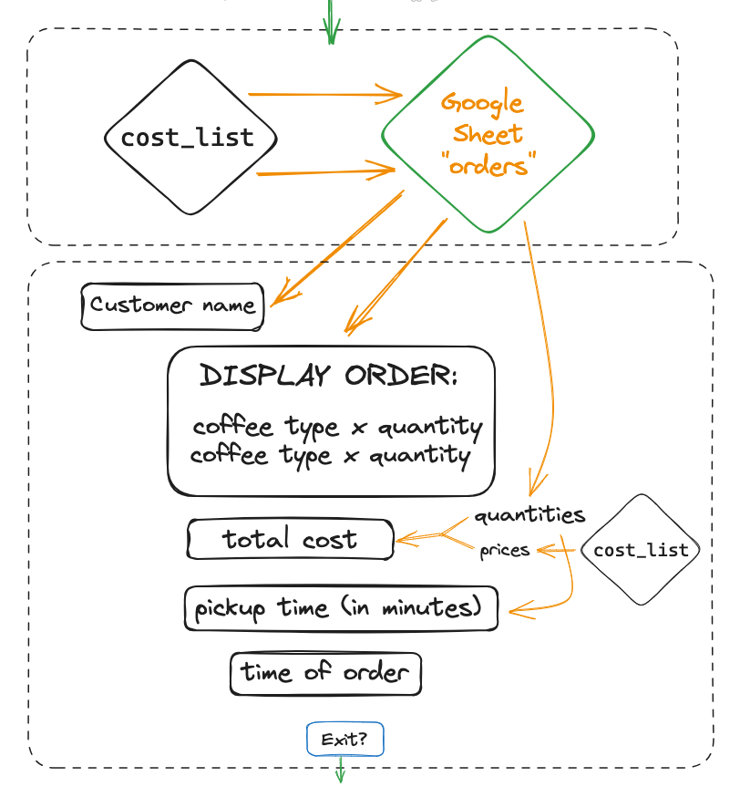

### Exit:

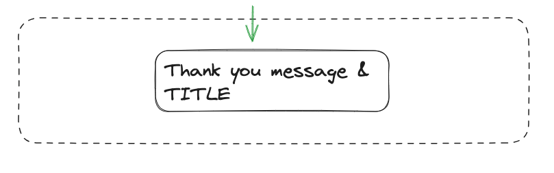

## Input Validation

All user inputs are validated:

**“Shall I show you the menu?”**

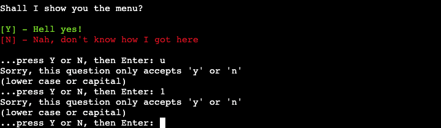

**“Choose an option # (1-6)”**

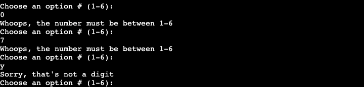

**“How many of these would you like?(1-10)”**

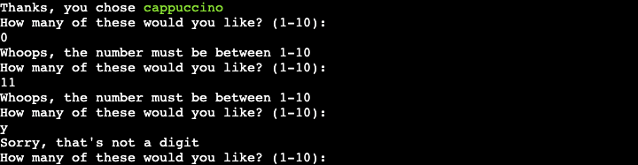

**“Would you like to add more to the order?”**

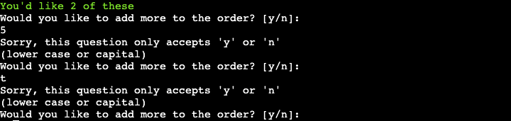

**“What name should we write on your order?”**

**“Press ENTER to exit”**

## Fixed Bugs
| Bug | Fix |
|---|---|
| There was a bug with the `display_pending_order()` function, which would retrieve the penultimate order rather than the order that was just made. | This was because `pending_orders = ORDERS_SPREADSHEET.get_all_values()` was being defined at the top of the program as a global variable. Moving the variable definition to inside the `display_pending_order()` function delayed the fetching of the order data until after the order had been made. |

## Features to Implement in the Future

- The coffee menu is currently hard-coded to 6 items. In the future the length of the menu could be pulled from Google Sheets so the stall owner could update the number of items without having to change the code.
- The ability to choose other milk options.
- The ability to take into account all active orders when working out the pickup time with the `calculate_pickup_time()` function.

## Testing

### Automated Testing

The Python code was tested with [Code Institute’s Python Linter](https://pep8ci.herokuapp.com/). No errors were found:

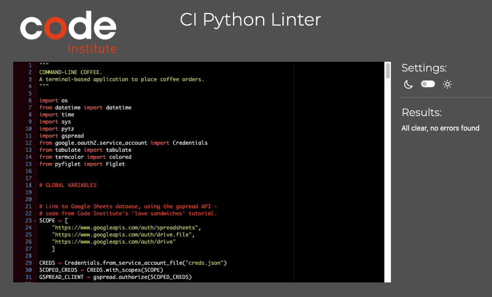

### Manual Testing

| Feature | Action | Expected Behaviour | Pass/fail |
|---|---|---|---|
| Title | Run program | Title & introduction displayed. “Shall I show you the menu?” displayed | PASS |
| Display menu dialogue | Enter “y” or “Y” | Displays menu | PASS |
| Display menu dialogue | Enter “n” or “N” | Displays title & prints “See ya next time..” | PASS |
| Display menu dialogue | Enter anything other than “y”, “Y”, “n” or “N” | Prints “Sorry, this question only accepts 'y' or 'n’. (lower case or capital)” | PASS |
| Choose an option (# 1-6) | Enter 1-6 | Prints “Thanks you chose {coffee type}” and asks for quantity required. Adds selection to  order_list | PASS |
| Choose an option (# 1-6) | Enter a number less than 1, or greater than 6 | Prints "Whoops, the number must be between 1-6” | PASS |
| Choose an option (# 1-6) | Enter something other than an integer | Prints "Sorry, that's not a digit” | PASS |
| “How many of these would you like?” dialogue | Enter a non-integer | Prints "Sorry, that's not a digit” | PASS |
| “How many of these would you like?” dialogue | Enter a number less than 1, or greater than 10 | Prints "Whoops, the number must be between 1-10” | PASS |
| “How many of these would you like?” dialogue | Enter a number between 1-10 | Prints “You’d like {number} of these” and updates  order_list. Prints "Would you like to add more to the order? [y/n]” | PASS |
| "Would you like to add more to the order? [y/n]” dialogue | Enter “y” or “Y” | Prints “Choose an option (# 1-6)” | PASS |
| "Would you like to add more to the order? [y/n]” dialogue | Enter “n” or “N” | Prints "What name should we write on your order?:” | PASS |
| "Would you like to add more to the order? [y/n]” dialogue | Enter anything other than “y”, “Y”, “n” or “N” | Prints “Sorry, this question only accepts 'y' or 'n’. (lower case or capital)” | PASS |
| "What name should we write on your order?” dialogue | Enters a string between 1-30 characters long | Sends  order_list to the Google Sheet ‘orders’.  Displays capitalised name, table of order, total cost, pickup time, and order time. Prints “Press ENTER to exit” | PASS |
| "What name should we write on your order?” dialogue | Enters a string between less than 1 or more than 30 characters long | Prints "Please enter a name between 1-30 characters long” | PASS |
| “Press ENTER to exit” | Enter “Enter” | Prints “"Thanks for using” and displays the title | PASS |
| “Press ENTER to exit” | Enters any other key before pressing “Enter” | Prints "Just the 'Enter' key will do. Please press to exit.” | PASS |

## Technologies Used

- Language Used:
    - [Python](https://www.python.org/)
- [Visual Studio Code](https://code.visualstudio.com/) - as the code editor.
- [Git](https://git-scm.com/) - for version control, using the Gitpod IDE.
- [GitHub](https://github.com/) - for storing the project.
- [Google Sheets](https://docs.google.com/spreadsheets/) - as the database.
- [Heroku](https://heroku.com) - to deploy the project.
- [Code Institute’s Python Linter](https://pep8ci.herokuapp.com/) - for automated testing of the Python code.
- [Code Beautify](https://codebeautify.org/python-formatter-beautifier) - as a code formatter.
- [Diffchecker](https://www.diffchecker.com/) - used to compare the changes suggested by Code Beautify.
- [Excalidraw](https://excalidraw.com/) - to create the flow diagrams.
- [TinyPNG](https://tinypng.com/) - to compress the Readme images.
- [Ezgif](https://ezgif.com/) - to convert the Readme GIFs.

## APIs Used

- [gspread](https://docs.gspread.org/en/latest/index.html) - a Python API for Google Sheets.

## Modules & Libraries Used

- [google-auth](https://google-auth.readthedocs.io/en/master/index.html) - to authenticate access to the Google Sheet.
- [os](https://docs.python.org/3/library/os.html) - to create the `clear_screen()` function.
- [pyfiglet](https://pypi.org/project/pyfiglet/0.7/) - to style the title ACSII font.
- [termcolor](https://pypi.org/project/termcolor/) - to add colour to text.
- [time](https://docs.python.org/3/library/time.html) - for the `time.sleep()` function, to pause the printing of text.
- [sys](https://docs.python.org/3/library/sys.html) - used alongside the ********time******** module, for the `typing_effect()` function.
- [tabulate](https://pypi.org/project/tabulate/) - to format data into tables.
- [datetime](https://docs.python.org/3/library/datetime.html) - to get the time in hours and minutes, for the `display_current_time()` function.
- [pytz](https://pypi.org/project/pytz/) - to get the London timezone.

## Deployment

***include API info

## Credits

### Code

Used as inspiration:
- Clearing the terminal - [appdividend.com](https://appdividend.com/2022/06/03/how-to-clear-console-in-python/?utm_content=cmp-true)
- The `typing_effect()` function - [101computing.net](https://www.101computing.net/python-typing-text-effect/)
- Input validation - [bobbyhadz.com](https://bobbyhadz.com/blog/python-input-validation)
- Iterating alternatively through two lists, using the zip() function. - [w3schools.com](https://www.w3schools.com/python/ref_func_zip.asp)
- Converting a list of strings into a list of integers, in the `calculate_pickup_time()` function - [geeksforgeeks.org](https://www.geeksforgeeks.org/python-converting-all-strings-in-list-to-integers/)
- Getting the current time - [programiz.com](https://www.programiz.com/python-programming/datetime/current-time)

### Acknowledgements

- My mentor Brian Macharia for his invaluable guidance.