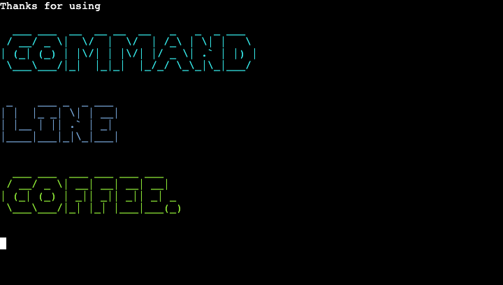

# Command Line Coffee

[View the live project here](https://command-line-coffee-c81dfcb828b5.herokuapp.com/)


**Command Line Coffee** command-line interface (CLI) application, made with Python. It’s a back-end project, hosted by a front-end [mock terminal](https://github.com/Code-Institute-Org/python-essentials-template) made by [Code Institute](https://codeinstitute.net/), and deployed using [Heroku](https://www.heroku.com/). It uses Google Sheets for a database, via the **gspread API**.

It is built to be used by a coffee stall in the foyer of a large co-working space. Customers can make an order from their desks, and then walk down and pick it up when it’s ready. The retro look of a command-line interface gives the user the feeling of using a quirky computer program from the 1970s.

## Features

### Title & Introduction

Displays the program title, using **pyfiglet** for the ASCII art font and **termcolor** for the text colours.

The `time.sleep()` function is used to stagger the printing of the title, and the introduction text is styled with a typing effect.


### Enter

The user is asked if they want to see the menu.


### Display Coffee Menu

The coffee menu is pulled from Google Sheets and displayed as a table using **tabulate.**


The Google Sheet is easily edited by the barista, enabling them to change prices and coffee types without having to edit the Python code. 

The ‘coffee-menu’ spreadsheet looks like this inside Google Sheets:


### Choose Coffee and Quantity

The user is asked to choose the coffee type and the quantity. 


### Add More Coffee

The option is given to add to the order.


### Customer Name

The user is asked for their name, to be used as an order reference.


Upon entering a name, the order is sent to the Google Sheet ‘orders’, and appears like this to the barista:


### Display Pending Order

The order is then imported back into the program from the ‘orders’ Google Sheet, and displayed to the user as a table, using **tabulate**.

Underneath the table, Python functions calculate the total cost, waiting time, and display the time of order.


### Goodbye

The user is given the option to exit the program, and a ‘thank you’ message is displayed.



## Flowcharts

### Title:


### Menu:


### Update database & display order:


### Exit:


## Input Validation

All user inputs are validated:

**“Shall I show you the menu?”**


**“Choose an option # (1-6)”**


**“How many of these would you like?(1-10)”**


**“Would you like to add more to the order?”**


**“What name should we write on your order?”**


**“Press ENTER to exit”**


## Fixed Bugs
| Bug | Fix |
|---|---|
| There was a bug with the `display_pending_order()` function, which would retrieve the penultimate order rather than the order that was just made. | This was because `pending_orders = ORDERS_SPREADSHEET.get_all_values()` was being defined at the top of the program as a global variable. Moving the variable definition to inside the `display_pending_order()` function delayed the fetching of the order data until after the order had been made. |

## Features to Implement in the Future

- The coffee menu is currently hard-coded to 6 items. In the future the length of the menu could be pulled from Google Sheets so the stall owner could update the number of items without having to change the code.
- The ability to choose other milk options.
- The ability to take into account all active orders when working out the pickup time with the `calculate_pickup_time()` function.

## Testing

### Automated Testing

The Python code was tested with [Code Institute’s Python Linter](https://pep8ci.herokuapp.com/). No errors were found:


### Manual Testing

| Feature | Action | Expected Behaviour | Pass/fail |
|---|---|---|---|
| Title | Run program | Title & introduction displayed. “Shall I show you the menu?” displayed | PASS |
| Display menu dialogue | Enter “y” or “Y” | Displays menu | PASS |
| Display menu dialogue | Enter “n” or “N” | Displays title & prints “See ya next time..” | PASS |
| Display menu dialogue | Enter anything other than “y”, “Y”, “n” or “N” | Prints “Sorry, this question only accepts 'y' or 'n’. (lower case or capital)” | PASS |
| Choose an option (# 1-6) | Enter 1-6 | Prints “Thanks you chose {coffee type}” and asks for quantity required. Adds selection to  order_list | PASS |
| Choose an option (# 1-6) | Enter a number less than 1, or greater than 6 | Prints "Whoops, the number must be between 1-6” | PASS |
| Choose an option (# 1-6) | Enter something other than an integer | Prints "Sorry, that's not a digit” | PASS |
| “How many of these would you like?” dialogue | Enter a non-integer | Prints "Sorry, that's not a digit” | PASS |
| “How many of these would you like?” dialogue | Enter a number less than 1, or greater than 10 | Prints "Whoops, the number must be between 1-10” | PASS |
| “How many of these would you like?” dialogue | Enter a number between 1-10 | Prints “You’d like {number} of these” and updates  order_list. Prints "Would you like to add more to the order? [y/n]” | PASS |
| "Would you like to add more to the order? [y/n]” dialogue | Enter “y” or “Y” | Prints “Choose an option (# 1-6)” | PASS |
| "Would you like to add more to the order? [y/n]” dialogue | Enter “n” or “N” | Prints "What name should we write on your order?:” | PASS |
| "Would you like to add more to the order? [y/n]” dialogue | Enter anything other than “y”, “Y”, “n” or “N” | Prints “Sorry, this question only accepts 'y' or 'n’. (lower case or capital)” | PASS |
| "What name should we write on your order?” dialogue | Enters a string between 1-30 characters long | Sends  order_list to the Google Sheet ‘orders’.  Displays capitalised name, table of order, total cost, pickup time, and order time. Prints “Press ENTER to exit” | PASS |
| "What name should we write on your order?” dialogue | Enters a string between less than 1 or more than 30 characters long | Prints "Please enter a name between 1-30 characters long” | PASS |
| “Press ENTER to exit” | Enter “Enter” | Prints “"Thanks for using” and displays the title | PASS |
| “Press ENTER to exit” | Enters any other key before pressing “Enter” | Prints "Just the 'Enter' key will do. Please press to exit.” | PASS |

## Technologies Used

- Language Used:
    - [Python](https://www.python.org/)
- [Visual Studio Code](https://code.visualstudio.com/) - as the code editor.
- [Git](https://git-scm.com/) - for version control, using the Gitpod IDE.
- [GitHub](https://github.com/) - for storing the project.
- [Google Sheets](https://docs.google.com/spreadsheets/) - as the database.
- [Heroku](https://heroku.com) - to deploy the project.
- [Code Institute’s Python Linter](https://pep8ci.herokuapp.com/) - for automated testing of the Python code.
- [Code Beautify](https://codebeautify.org/python-formatter-beautifier) - as a code formatter.
- [Diffchecker](https://www.diffchecker.com/) - used to compare the changes suggested by Code Beautify.
- [Excalidraw](https://excalidraw.com/) - to create the flow diagrams.
- [TinyPNG](https://tinypng.com/) - to compress the Readme images.
- [Ezgif](https://ezgif.com/) - to convert the Readme GIFs.

## APIs Used

- [gspread](https://docs.gspread.org/en/latest/index.html) - a Python API for Google Sheets.

## Modules & Libraries Used

- [google-auth](https://google-auth.readthedocs.io/en/master/index.html) - to authenticate access to the Google Sheet.
- [os](https://docs.python.org/3/library/os.html) - to create the `clear_screen()` function.
- [pyfiglet](https://pypi.org/project/pyfiglet/0.7/) - to style the title ACSII font.
- [termcolor](https://pypi.org/project/termcolor/) - to add colour to text.
- [time](https://docs.python.org/3/library/time.html) - for the `time.sleep()` function, to pause the printing of text.
- [sys](https://docs.python.org/3/library/sys.html) - used alongside the ********time******** module, for the `typing_effect()` function.
- [tabulate](https://pypi.org/project/tabulate/) - to format data into tables.
- [datetime](https://docs.python.org/3/library/datetime.html) - to get the time in hours and minutes, for the `display_current_time()` function.
- [pytz](https://pypi.org/project/pytz/) - to get the London timezone.

## Deployment

### Forking the GitHub Repository

By forking the GitHub Repository we make a copy of the original repository on our GitHub account to view and/or make changes without affecting the original repository by using the following steps...

1. Log in to GitHub and locate the [GitHub Repository](https://github.com/timgoalen/command-line-coffee)
2. At the top right of the Repository, just below the GitHub navbar, click on the "Fork" Button.
3. You should now have a copy of the original repository in your GitHub account.

### Making a Local Clone

1. Log in to GitHub and locate the [GitHub Repository](https://github.com/timgoalen/command-line-coffee)
2. Above the list of files, click "Code".
3. To clone the repository using HTTPS, under "Clone with HTTPS", copy the link.
4. Open Git Bash
5. Change the current working directory to the location where you want the cloned directory to be made.
6. Type `git clone`, and then paste the URL you copied in Step 3.

```
$ git clone https://github.com/YOUR-USERNAME/YOUR-REPOSITORY
```

7. Press Enter. Your local clone will be created.

```
$ git clone https://github.com/YOUR-USERNAME/YOUR-REPOSITORY
> Cloning into `CI-Clone`...
> remote: Counting objects: 10, done.
> remote: Compressing objects: 100% (8/8), done.
> remove: Total 10 (delta 1), reused 10 (delta 1)
> Unpacking objects: 100% (10/10), done.
```

Click [Here](https://help.github.com/en/github/creating-cloning-and-archiving-repositories/cloning-a-repository#cloning-a-repository-to-github-desktop) to retrieve pictures for some of the buttons and more detailed explanations of the above process.

8. For changes you've made to reflect on the live site*:

    -   Type `git add <files changed> `
    -   Type `git commit -m <description of change> `
    -   Type `git push`

    *In Heroku, after pushing to Github - if 'automatic deploys' aren't enabled, manually deploy by clicking 'Deploy Branch' in the Manual Deploy section.

### Create a Spreadsheet using Google Sheets

1. Create a new spreadsheet in [Google Sheets](https://docs.google.com/spreadsheets), name it ‘coffee-run’.
2. Within the spreadsheet, create 2 sheets called ‘cofee_menu’ and ‘orders’.
3. Within the ‘coffee_menu’ sheet, create 3 headings called ‘Coffee’, ‘Price’ and ‘#’.
4. Populate the next 6 rows with your choice of coffees and prices, in the ‘#’ column, enter 1-6 in descending order [refer to the Google Sheets screenshots in the ‘Features/Display Coffee Menu’ section in this README].
5. Within the ‘orders’ sheet, enter the headings ‘name’, ‘item’, ‘quantity’, ‘item’ and ‘quantity’. [refer to the Google Sheets screenshots in the ‘Features/Customer Name’ section in this README]

### Set up the API with Google Cloud

1. Open [Google Cloud.](https://console.cloud.google.com/)
2. Click the “Select a project”  button and  select “new project”
3. Name the project, and click “Select Project”.
4. From the side menu, select "APIs and services", then select “Library”.
5. Use the search bar  to search for Google Drive,  and select ‘API’, then ‘Enable’.
6. Once redirected to the API overview page, click  the “Create credentials”.
7. A form appears: In the "Which API are you using"  dropdown menu, select "Google Drive API".
8. Select ‘web server’, then ‘application data’, and ‘no’ for the question ‘app or computer engine’
9. Click “What credentials do I need?”
10. Enter a service  account name.
11. Choose ‘Project  > Editor’ in the ‘role’ selection.
12. Select ‘JSON’ for the key type.
13. Click ‘continue’, which will download the credentials file onto your computer.
14. From the side menu, select "APIs and services", then select “Library”.
15. Use the search bar  to search for Google Sheets,  and select ‘Google Sheets API’, then ‘Enable’.
16. Locate the creds.json file that was downloaded to your computer.
17. Add it to your IDE.
18. Open creds.json and copy the client_email value.
19. Open your Google Sheet spreadsheet and click ‘Share’.
20. Paste the client_email value from the creds.json file; select “Editor”, deselect “Notify People” then click “Share”
21. Make sure the “creds.json” is added to the .gitignore file within your IDE, so the authentication details aren’t uploaded to GitHub.

### Deploy to Heroku

1. Create a [Heroku](https://www.heroku.com/) account.
2. In the dashboard, click on ‘Create new app’ from the ‘New’ dropdown menu in the top right.
3. Name the app and choose a region.
4. In the ‘Settings’ tab, click on 'Reveal Config Vars’.
5. In the ‘KEY’ field, write ‘CREDS’.
6. In the ‘VALUE’ field, paste the contents of your ‘creds.json’ file. [Your creds.json file should be previously listed in your .gitignore file, to prevent authentication details being pushed to Github]
7. Add an additional Config Var below, write ‘PORT’ for the KEY and ‘8000’ for the VALUE.
8. In the 'Buildpacks' section click 'Add buildpack'.
9. First, select ‘Python’, and click 'save changes'.
10. Then, select ‘node.js’, and click 'save changes'.
11. In the 'Deploy' tab, select GitHub as the deployment method, and click 'Connect to GitHub'.
12. In the 'App Connected to GitHub' section, search for the GitHub repository name, select it then click 'connect'.
13. Finally, either click ‘Enable Automatic Deploys’, or ‘Deploy Branch’ in the ‘Manual deploy’ section.

## Credits

### Code

Used as inspiration:
- Clearing the terminal - [appdividend.com](https://appdividend.com/2022/06/03/how-to-clear-console-in-python/?utm_content=cmp-true)
- The `typing_effect()` function - [101computing.net](https://www.101computing.net/python-typing-text-effect/)
- Input validation - [bobbyhadz.com](https://bobbyhadz.com/blog/python-input-validation)
- Iterating alternatively through two lists, using the zip() function. - [w3schools.com](https://www.w3schools.com/python/ref_func_zip.asp)
- Converting a list of strings into a list of integers, in the `calculate_pickup_time()` function - [geeksforgeeks.org](https://www.geeksforgeeks.org/python-converting-all-strings-in-list-to-integers/)
- Getting the current time - [programiz.com](https://www.programiz.com/python-programming/datetime/current-time)

### Acknowledgements

- My mentor Brian Macharia for his invaluable guidance.